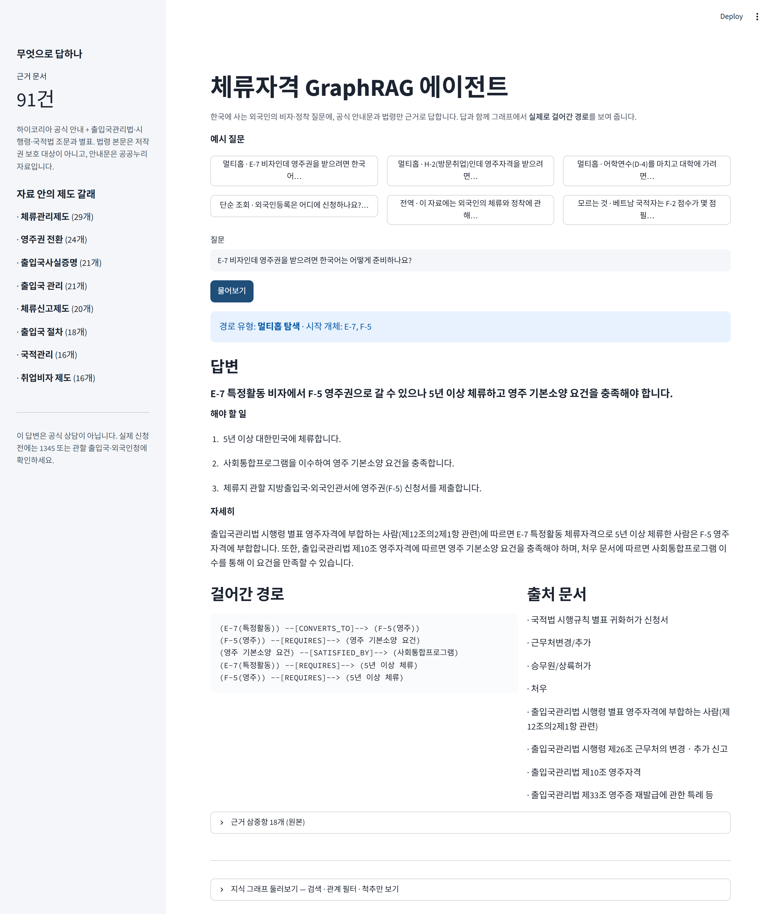
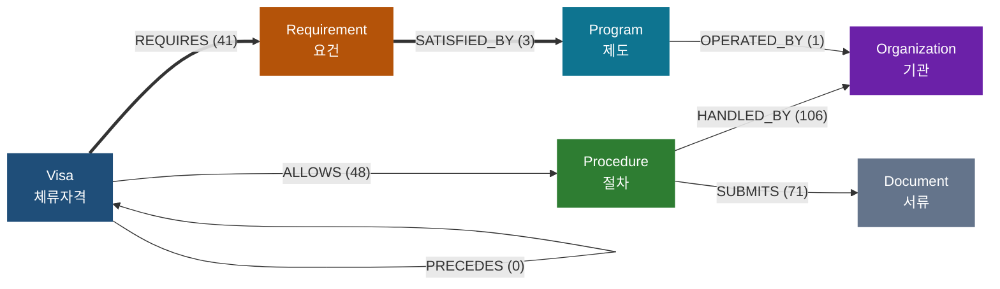

# 체류자격 GraphRAG 에이전트

### ▶︎ 바로 써 보기

```bash
git clone https://github.com/jubyeong-kim/visa-graph-agent && cd visa-graph-agent
pip install -r requirements.txt
cp .env.example .env          # OPENAI_API_KEY 를 채운다
streamlit run app.py          # 그래프는 이미 들어 있어 바로 뜬다
```

> 공개 배포는 아직 하지 않았다. 질문 한 번마다 모델 호출이 일어나 **열어 두면
> 모르는 사람의 질문에 저장소 주인이 비용을 낸다.** 로컬 실행을 기본으로 둔다.

한국에 사는 외국인의 비자·정착 질문에 답한다.
답만 주지 않고, **지식 그래프에서 실제로 걸어간 경로와 출처 문서를 함께** 보여 준다.

```
질문 ──→ ① 갈래 판정 ──→ ② 시작 개체 찾기 ──→ ③ n홉 확장 ──→ ④ 근거 조립
              │                                   │              │
              │ 전역                          근거 없음      ⑤ 답변 ──→ ⑥ 숫자 검증 ──→ 답
              ↓                                   ↓                        │
        커뮤니티 요약 ─────────────────────→ 반경 넓히기(2회)        위반 → 재작성 1회
                                                  ↓
                                        그래도 없으면 "모른다"
```



## 이 질문에 답할 수 있다

> **"E-7 비자인데 영주권을 받으려면 한국어는 어떻게 준비하나요?"**

```
E-7(특정활동) --[CONVERTS_TO]--> F-5(영주)
              --[REQUIRES]--> 영주 기본소양 요건
              --[SATISFIED_BY]--> 사회통합프로그램
```

이 답은 **어느 문서에도 한 줄로 적혀 있지 않다.**
시행령 별표 1의3에는 영주 전환 조건만, 「처우」 안내문에는 사회통합프로그램 이야기만 있다.
**세 사실을 이어 붙여야** 답이 나온다. 키워드 검색(BM25)은 E-7 문서 하나만 들고 온다.

## 왜 이 주제인가

근거 문서가 **실제로 존재하고, 서로 얽혀 있기** 때문이다.

체류자격 전환 경로(`E-9 → E-7-4 → F-2 → F-5`)는 그 자체가 그래프다. 한 문서에 다 적혀
있지 않고 법령과 안내문에 흩어져 있어서, **멀티홉이 인위적 설계 없이 성립한다.**
그리고 법령과 관공서 안내문이라 문장이 확정적이어서, 답변에 "이 문서의 이 문장"을
그대로 붙일 수 있다.

무엇보다 **틀리면 사람의 체류 자격에 영향을 주는 영역**이다. 근거 없이 지어내지 않고
모른다고 말하는 것이 이 도메인에서는 기능이다.

## 무엇으로 답하나

| 소스 | 무엇 | 건수 |
|---|---|---|
| 하이코리아 `hikorea.go.kr` | 체류·국적·동포·난민 공식 안내 | 36 |
| 국가법령정보 `law.go.kr` | 출입국관리법·시행령·국적법 조문과 별표 | 46 |

**91건.** 수집 전 `robots.txt` 를 확인하고 본문 경로 수집이 허용된 것만 썼다.
법령 본문은 저작권법 제7조상 보호 대상이 아니다. 공공누리 **제4유형(변경금지)** 인
`체류자격별 안내 매뉴얼(.hwp)` 은 **쓰지 않았다** — 그래프로 가공하는 것이 변경에
해당할 수 있다.

## 스키마

굵은 화살표가 **멀티홉의 척추**다. 괄호 안은 실제로 뽑힌 엣지 수 —
`config.json` 과 그래프에서 자동 생성하므로 그림만 옛날 것으로 남는 일이 없다
(`python make_views.py`).




**동적 그래프**: `python make_views.py` → `output/graph.html` 을 브라우저로 열면
검색·관계 필터·"척추만 보기"로 직접 둘러볼 수 있다. 데모 화면 맨 아래에도 붙어 있다.

## 나가는 길이 셋이다

| 길 | 언제 | 무엇으로 답하나 |
|---|---|---|
| **단순 조회** | 대상 하나의 사실을 물을 때 | 1홉 이웃 |
| **멀티홉** | 여러 사실을 이어야 할 때 | n홉 확장 + 탄 경로 기록 |
| **전역 요약** | 자료 전체의 갈래를 물을 때 | 커뮤니티 16개의 요약 |

**근거가 없으면 답하지 않는다.** 반경을 두 번까지 넓혀 보고, 그래도 없으면
"제가 가진 자료로는 확인되지 않습니다"라고 말한 뒤 **무엇이 없어서 못 답하는지**를 알린다.
모델의 확신이 기준인 곳은 한 곳도 없다.

마지막 `verify` 단계는 근거에 없는 숫자(기간·금액·급수)가 답변에 섞였는지 **기계로
대조**하고, 걸리면 한 번 다시 쓰게 한다. 이 도메인은 "5년"과 "3년"이 완전히 다른 답이다.

## 모델

`config.json` 의 `model.provider` 로 고른다. 심판은 언제나 생성 모델과 다르게 둔다.

| provider | 추출·답변 | 심판 |
|---|---|---|
| `openai` (현재) | `gpt-4.1-mini` | `gpt-4.1` |
| `anthropic` | `claude-sonnet-5` | `claude-opus-5` |

Claude 로 바꿀 때 걸리는 것 두 가지:

- **Claude 5 세대는 `temperature` 를 거부한다(400).** 샘플링 파라미터가 제거됐다.
  `llm.py` 가 제공자별로 갈라 막는다.
- **`langchain-anthropic` 은 `api_key=''`(빈 문자열)을 명시적으로 넘긴다.**
  그래서 `ant auth login` 으로 만든 OAuth 프로필을 쓰지 못한다 — 빈 키가
  자격증명 해석 순서에서 이겨 버려, 빈 키를 그대로 전송하고 인증에 실패한다.
  Claude 를 쓰려면 `ANTHROPIC_API_KEY` 가 있어야 한다.

## 성능

같은 골든셋 30문항을 GraphRAG 와 basic RAG(BM25 상위 3문서)에 똑같이 물었다.
아래는 **`gpt-4.1-mini` 생성 · `gpt-4.1` 심판**으로 잰 값이다.

| 홉 | 문항 | GraphRAG | BM25 | 경로 재현 | 경로 정밀 | F1 | 근거 수 |
|---|---|---|---|---|---|---|---|
| 1홉 | 11 | **10** | 9 | 100% | 32% | 0.39 | 9.3 |
| 2홉 | 13 | 9 | **10** | 63% | 9% | 0.15 | 12.4 |
| **3홉** | 5 | **5** | 2 | 87% | 16% | 0.27 | 16.4 |
| 전역 | 1 | 0 | 0 | — | — | — | — |
| 합계 | 30 | **24** | 21 | | | | |

| 홉 | GraphRAG | BM25 | 차이 |
|---|---|---|---|
| 1홉 | **10/11 (91%)** | 9/11 (82%) | +9%p |
| 2홉 | 9/13 (69%) | **10/13 (77%)** | −8%p |
| **3홉** | **5/5 (100%)** | 2/5 (40%) | **+60%p** |

**읽을 칸은 3홉이다.** 1·2홉 질문의 답은 정부 안내문 **한 장 안에 통째로** 들어
있어서, BM25 가 그 문서만 집어 오면 답이 나온다. 그래프가 있어야 할 이유가 없는
질문이다. 실제로 2홉에서는 아직 대조군이 더 맞힌다.

`E-7 → F-5 → 영주 기본소양 요건 → 사회통합프로그램` 은 다르다. 어느 한 문서에도
이어져 있지 않다. 여기서 BM25 는 2/5, 그래프는 5/5 다.

즉 이 프로젝트가 보인 것은 "GraphRAG 가 더 낫다"가 아니라 **"문서를 가로질러야
하는 질문에서만 낫다"** 이다.

### 대조군을 얼린 이유

이 표를 믿으려면 먼저 자가 움직이지 않아야 한다. 처음에는 실행할 때마다 BM25
답변을 새로 만들었는데, **코드를 한 줄도 안 고쳤는데 대조군 점수가 17 → 19 → 21
로 움직였다.** 검색 결과는 같아도 답을 쓰는 LLM 이 실행마다 달라서다. 움직이는
자를 대고 "그래프가 더 낫다"고 말할 수는 없다.

그래서 대조군 답변을 `output/basic_answers.json` 에 얼려 두었다. 고른 것은
**세 번 중 가장 높게 나온 21/30 실행**이다. 대조군에 유리한 쪽으로 고정하는 게
맞다. 위 표는 그렇게 고정한 자로 잰 값이다.

자를 고정하자 한동안 결론이 뒤집혔다. 고정 전에는 `19:17 로 앞선다` 고 적혀 있었고,
고정하니 **19:21 로 대조군이 더 맞혔다.** 그 상태에서 실패 30건을 하나씩 읽어 세 가지를 고쳤고
(아래) 24:21 이 되었다. 뒤집혔던 구간도 [REPORT.md](REPORT.md) 에 그대로 남겼다.

고친 것은 셋이다. 셋 다 **그래프가 틀린 게 아니라 안 찾아진 것**이었다.

- **조사 하나** — 기간 규칙이 `90일` 다음에 바로 `초과` 가 와야 잡았다. 안내문은
  "90일**을** 초과하여" 라고 쓴다. 외국인등록의 핵심 요건이 통째로 빠져 있었고,
  옆에 있던 "15일 이내"(변경신고 기한)로 **틀린 답을 단정적으로** 했다.
- **한국어는 동사가 끝에 온다** — "…15일 이내에 …외국인등록사항변경신고를 하여야
  합니다" 에서 주어는 뒤에 있다. 앞만 보다가 줄 맨 앞의 `외국인등록` 을 집었다.
- **`분류:` 줄을 안 쓰고 있었다** — 안내문마다 머리에 `분류: 안내, D-1, D-2, …` 로
  그 절차를 쓸 수 있는 체류자격이 적혀 있는데 본문을 읽을 때 버리고 있었다.
  이걸 살리니 `ALLOWS` 엣지가 109개 생겼다.

골든셋을 12문항에서 30문항으로 늘린 과정과, 거기서 드러난 색인 구멍
(기한·기간 요건이 한 부류로 통째로 안 뽑힘)은 [REPORT.md](REPORT.md) 에 있다.

## 처음부터 다시 만들려면

```bash
python fetch_docs.py          # 코퍼스 수집 (약 3분, LLM 불필요)
python build_graph.py --force # LLM 재추출 (약 1분, $0.05 정도)
python test_rules.py          # 규칙·정규화 자체 검사
python evaluate.py            # 홉수별 채점 + BM25 대조
python agent.py "E-9 비자인데 영주권까지 갈 수 있나요?"
```

## 만들면서 배운 것

**규칙이 LLM 보다 잘하는 자리가 있다.** 전환 관계 16개 중 14개가 규칙에서 나왔다.
법령 별표가 영주자격 요건을 이미 표로 적어 두었기 때문이다. 가장 중요한 관계가
구조화돼 있는데 거기에 LLM 을 부르는 것은 비싸고 불안정하기만 하다.

**LLM 추출은 `temperature=0` 이어도 실행마다 달라진다.** 한국어 능력과 비자를 잇는
유일한 다리(`영주 기본소양 요건 → 사회통합프로그램`)가 나왔다 말았다 해서, 결국
규칙으로 내렸다. `output/cache/` 를 저장소에 포함한 것도 같은 이유다 —
**캐시가 이 저장소의 재현성 장치다.**

**조용히 깨지는 고장이 제일 무섭다.** 각 호를 쪼개는 정규식이 `"10. 주재(D-7)부터
20. 특정활동(E-7)까지"` 를 "20." 에서 잘라 범위를 반토막 냈다. 그래프 통계는 멀쩡했고
전환 관계만 소리 없이 사라졌다. `test_rules.py` 가 그 지점들을 지킨다.

## 구성

| 파일 | 하는 일 |
|---|---|
| `fetch_docs.py` | 코퍼스 수집. 건수·개체 겹침을 재서 **진행 여부를 스스로 판정**한다 |
| `build_graph.py` | LLM 추출 + 규칙 보강 + 정규화 + 커뮤니티 탐지·요약 |
| `agent.py` | LangGraph 에이전트 — 세 갈래 라우팅, 경로 기록, 숫자 검증 |
| `evaluate.py` | 홉수별 채점 · BM25 대조 · 경로 재현·정밀·F1 · 실패 층 분류 |
| `app.py` | streamlit 데모 |
| `test_rules.py` · `test_traversal.py` | 자체 검사 (LLM 없이 돈다) |
| `sweep.py` · `probe_faq.py` · `capture_demo.py` | 근거 상한 쓸기 · 외부 질문 찔러보기 · 데모 캡처 |
| `config.json` | 스키마·반경·허브 차단·근거 예산·별칭과 **합치지 않은 이유** |
| [REPORT.md](REPORT.md) | 설계 판단, 측정 결과, 실패 분석, 회고 |

```
data/docs/       원본 82건          output/graph.graphml     지식 그래프
data/goldenset.json  평가 12문항     output/communities.json  커뮤니티 요약
data/manifest.json   수집·제외 사유   output/eval.json         채점 결과
                                    output/cache/            추출 캐시(재현성)
```

---

**이 답변은 공식 상담이 아니다.** 실제 신청 전에는 **1345**(외국인종합안내센터) 또는
관할 출입국·외국인청에 확인해야 한다. 자료는 수집 시점 기준이며 법령과 지침은 바뀐다.
