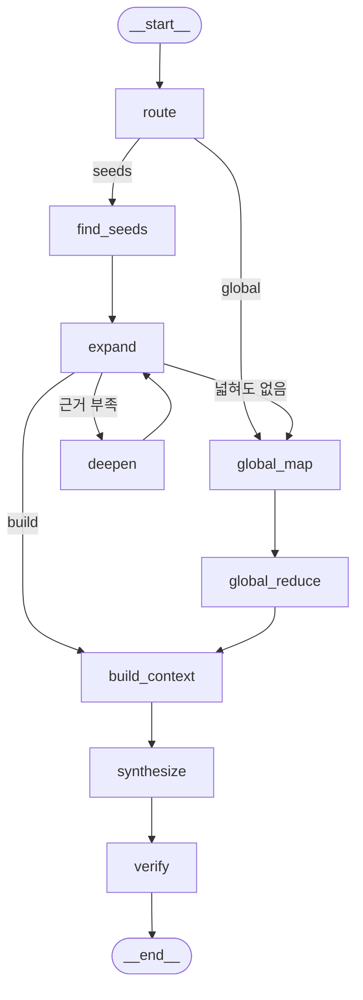

# 체류자격 GraphRAG 에이전트

한국에 사는 외국인의 비자·정착 질문에, **공식 안내문과 법령만 근거로** 답한다.
답과 함께 지식 그래프에서 **실제로 걸어간 경로**와 **출처 문서**를 보여 준다.

```
E-7(특정활동) --[CONVERTS_TO]--> F-5(영주)
              --[REQUIRES]--> 영주 기본소양 요건
              --[SATISFIED_BY]--> 사회통합프로그램
```

> "E-7 비자인데 영주권을 받으려면 한국어는 어떻게 준비하나요?"
>
> 이 답은 **어느 문서에도 한 줄로 적혀 있지 않다.** 시행령 별표에는 영주 전환 조건만,
> 「처우」 안내문에는 사회통합프로그램 이야기만 있다. 세 사실을 이어야 답이 나온다.

## 빠르게 돌려 보기

```bash
pip install -r requirements.txt
cp .env.example .env          # OPENAI_API_KEY 를 채운다
python build_graph.py         # 그래프 구축 (캐시가 있어 LLM 호출 없이 끝난다)
streamlit run app.py          # 데모 화면
```

처음부터 다시 만들려면:

```bash
python fetch_docs.py          # 코퍼스 수집 (약 3분)
python build_graph.py --force # LLM 재추출 (약 1분, $0.05 정도)
python test_rules.py          # 규칙·정규화 자체 검사
python evaluate.py            # 홉수별 채점 + BM25 대조
python agent.py "E-9 비자인데 영주권까지 갈 수 있나요?"
```


## 무엇으로 답하나

| 소스 | 무엇 | 건수 |
|---|---|---|
| 하이코리아 `hikorea.go.kr` | 체류·국적·동포·난민 공식 안내 | 36 |
| 국가법령정보 `law.go.kr` | 출입국관리법·시행령·국적법 등 조문과 별표 | 46 |

법령 본문은 저작권법 제7조상 보호 대상이 아니다. 하이코리아 안내는 공공누리 자료이며
출처를 표시한다. 공공누리 제4유형(변경금지)인 `체류자격별 안내 매뉴얼(.hwp)` 은
**쓰지 않았다** — 그래프로 가공하는 것이 변경에 해당할 수 있다.

## 구조



| 노드 | 하는 일 |
|---|---|
| `route` | 단순 조회 / 멀티홉 / 전역 세 갈래로 가른다 |
| `find_seeds` | 질문에서 시작 개체를 찾는다 (코드 → 정식 명칭 → 느슨한 이름) |
| `expand` | n홉까지 넓히며 근거를 모으고 탄 경로를 기록한다. 허브는 지나가지 않는다 |
| `deepen` | 반경을 한 단계 넓힌다. **최대 2회**, 그래도 없으면 "모른다" |
| `global_map` / `global_reduce` | 커뮤니티별 요약을 모아 전역 질문에 답한다 |
| `synthesize` | 모은 근거만으로 답을 쓴다 |
| `verify` | 근거에 없는 숫자가 섞였는지 기계로 대조하고, 걸리면 1회 재작성 |

`expand → global` 엣지가 중요하다. 시작 개체는 찾았는데 아무리 넓혀도 근거가 없으면
전역 요약으로 흘려보낸다 — "1홉인 줄 알았는데 사실 전역 질문"인 경우를 구제한다.

## 파일

| 파일 | 하는 일 |
|---|---|
| `fetch_docs.py` | 코퍼스 수집. 건수·개체 겹침을 재서 **진행 여부를 판정**한다 |
| `build_graph.py` | LLM 추출 + 규칙 보강 + 정규화 + 커뮤니티 탐지·요약 |
| `agent.py` | LangGraph 에이전트 |
| `evaluate.py` | 홉수별 채점 · BM25 대조 · 경로 재현율 · 실패 층 분류 |
| `app.py` | streamlit 데모 |
| `test_rules.py` | 규칙·정규화 자체 검사 (조용히 깨지는 곳만 지킨다) |
| `config.json` | 스키마·반경·허브 차단·근거 예산·별칭 |

`output/cache/` 는 일부러 저장소에 올린다. LLM 추출은 `temperature=0` 이어도
실행마다 결과가 달라진다. 캐시가 이 프로젝트의 **재현성 장치**다.

## 결과 요약

| 홉 | 문항 | GraphRAG | BM25 | 경로 재현율 |
|---|---|---|---|---|
| 1홉 | 3 | 2 | 2 | 67% |
| 2홉 | 6 | **4** | 3 | 75% |
| 3홉 | 2 | **2** | 1 | 100% |
| 전역 | 1 | 0 | 0 | — |
| 합계 | 12 | **8** | 6 | |

자세한 분석은 [REPORT.md](REPORT.md).

---

이 답변은 공식 상담이 아니다. 실제 신청 전에는 **1345** 또는 관할 출입국·외국인청에
확인해야 한다.
