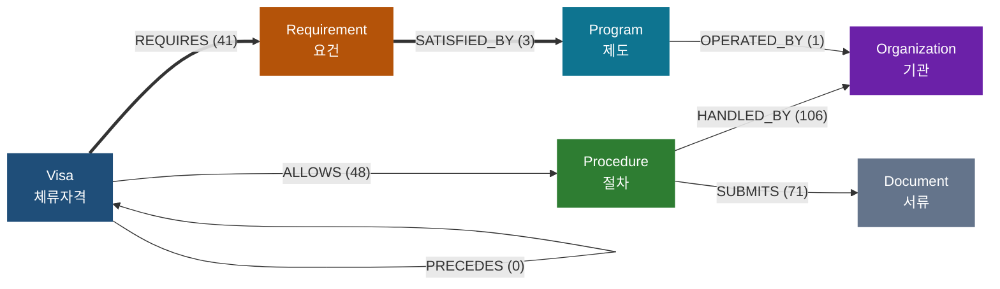

# REPORT — 체류자격 GraphRAG 에이전트

## 1. 주제와 코퍼스

### 왜 이 주제인가

한국에 사는 외국인이 "내 비자에서 영주권까지 어떻게 가나, 한국어는 얼마나 필요한가"를
물으면 근거와 경로를 대며 답하는 에이전트를 만들었다. 네 가지 이유로 골랐다.

1. **전환 경로가 그 자체로 그래프다.** `E-7 → F-5` 는 어느 한 문서에도 한 줄로 적혀 있지
   않다. 시행령 별표 1의3에는 영주 전환 조건만, 「처우」 안내문에는 사회통합프로그램
   이야기만 있다. 이어 붙여야 답이 나온다 — 멀티홉이 인위적 설계 없이 성립한다.
2. **basic RAG 가 무너지는 지점이 선명하다.** 뒤의 측정에서 2홉 이상 문항의 BM25 성적이
   실제로 떨어졌다.
3. **근거가 원문에 박혀 있다.** 법령과 관공서 안내문이라 문장이 확정적이고, 답변에
   "이 문서의 이 문장"을 그대로 붙일 수 있다.
4. **커뮤니티가 의미 있게 갈린다.** 뒤에서 보듯 영주권 전환 / 체류관리 / 국적관리 /
   취업비자 제도로 나뉘어, 전역 질문에 답할 거리가 생긴다.

### 탈락시킨 후보와 기준

문서 50건 이상, 문서 사이 개체 겹침, 멀티홉 성립 가능성 셋으로 걸렀다.

| 후보 | 탈락 이유 |
|---|---|
| 기념품 통관 규정 | 근거가 규정 문서 9건. 개체가 서로 안 얽혀 멀티홉 불성립 |
| 한국어·한글의 역사 | 그래프는 훌륭하지만 **대상이 안 맞는다** — 연구자용이지 학습자·이주민용이 아니다 |
| CITES·생물종 | 시드 10개의 링크 교차를 실제로 재 보니 공유 문서 68건인데 그중 대부분이 `INaturalist`·`GBIF`·`펍메드` 같은 분류상자 DB 링크였다. 진짜 관계는 분류학 계층뿐이라 멀티홉이 "코끼리는 장비목이다" 수준이 된다 |
| 한국어 문법 | ① 문법 해설 문서는 짧아 BM25 가 그냥 푼다 → 대조 실험에서 우위가 안 드러난다 ② `(-아서, 혼동됨, -(으)니까)` 는 원문 어디에도 없어 LLM 이 지어낸다 |

한국어 문법(B안)은 버리지 않고 **한국어 요건 축**으로 흡수했다. `사회통합프로그램`
노드가 그래프 안에 있고 체류자격 16개와 이어져 있어, 나중에 `TOPIK 급수 ↔ 사회통합
프로그램 단계` 엣지 하나만 더하면 한국어 쪽에서 물어도 비자까지 흘러간다.
그 대응표는 법무부 고시에 있고 자주 바뀌어, 지금 코퍼스에 없는 것을 넣지 않았다.

### 무엇을 몇 건 어떻게 모았나

| 소스 | 무엇 | 건수 |
|---|---|---|
| 하이코리아 `hikorea.go.kr` | 체류·국적·동포·난민 공식 안내 | 36 |
| 국가법령정보 `law.go.kr` (오픈API) | 출입국관리법·시행령·국적법·재한외국인법·외국인고용법 조문과 별표 | 46 |

**합계 91건 · 중앙값 724자.**

수집 전에 소스 네 곳의 `robots.txt` 를 모두 확인했고, 본문 경로 수집이 허용된 것만 썼다.

**계획에서 바꾼 것 세 가지** (전부 실제로 부딪혀서 바꿨다):

1. **최소 길이 800자 → 400자.** 정부 안내문은 위키 토막글과 다르다. 군더더기가 없어
   같은 정보를 절반 길이로 담는다. 800자로 자르면 `C-3 → D-8`, `D-4 → D-2` 전환 예시가
   그대로 적힌 「체류자격변경」(640자)이 버려진다.
2. **별표는 PDF 가 아니라 HWP 에서 뽑는다.** 같은 별표인데 PDF 에는 공백 문자가 아예
   없어 "외국의신문사, 방송사"로 나온다. HWP(OLE+zlib)는 띄어쓰기가 살아 있다.
   `olefile` 하나만 추가했고 네이티브 빌드가 필요 없다.
3. **겹침 지표를 문서 제목 기준으로 잡았다.** 비자 코드만 세면 35%인데, 그건 기관·절차·
   제도를 안 세기 때문이다. 위키 코퍼스에서 문서 제목이 곧 개체인 원리를 그대로 썼다.
   손으로 고른 단어 목록은 지표 조작이라 쓰지 않았다. 법령명 접두어("출입국관리법
   시행령")는 모든 법령 문서에 붙어 있어 반드시 걷어내야 한다 — 안 걷으면 겹침이
   94%로 나오는데 전부 접두어가 만든 가짜다.

**진행 판정** (`fetch_docs.py` 가 출력한다):

| 기준 | 목표 | 결과 |
|---|---|---|
| 문서 수 | 50건 이상 | **82건** |
| 개체 겹침 | 60% 이상 | **95%** |

제외한 10건도 사유와 함께 `data/manifest.json` 에 남겼다 — 도메인 지식이 아닌
안내·연락처 페이지 5건, 400자 미만 5건.

## 2. 스키마와 골든셋

### 스키마

노드 6종: `Visa` · `Procedure` · `Requirement` · `Organization` · `Program` · `Document`

관계는 **삼중항 튜플로 방향까지 고정**했다. 문자열로만 주면 `(사람, 출연, 영화)`인지
`(영화, 출연, 사람)`인지 정해지지 않아 문서마다 방향이 뒤집힌 엣지가 생긴다.



굵은 화살표가 멀티홉의 척추다. 괄호 안은 실제로 뽑힌 엣지 수 — 이 그림은
`config.json` 과 `output/graph.graphml` 에서 자동 생성한다(`python make_views.py`).
손으로 그리면 스키마를 고쳤을 때 그림만 옛날 것으로 남는다.

`PRECEDES` 가 0개인 것이 그대로 보인다. 스키마에 선언했지만 한 건도 안 뽑혔다 —
**선언한 관계가 다 쓰이는 것은 아니다.** 지우지 않고 남긴 것은 영주 요건에
"직전 체류자격" 조건이 있어 나중에 규칙으로 채울 자리이기 때문이다.

### 뽑지 않기로 한 것과 그 대가

| 안 뽑은 것 | 왜 | 대가 |
|---|---|---|
| 수수료 금액·처리 소요기간 | `10만원` 노드가 수십 문서를 잇는 가짜 허브가 된다 | 비용을 묻는 질문에 답 못 한다 |
| 국적별 예외 | 노드가 200개 늘고 골든셋 검증이 불가능해진다 | "베트남 국적은?" 류에 "모른다"고 답한다 |

**신청 기한은 처음에 함께 막았다가 되살렸다.** "처리 기간은 뽑지 마라"고 쓴 한 줄이
"언제까지 신청해야 하나"까지 막아 버렸다. 둘은 전혀 다른 것이고, 신청 기한은 사용자가
가장 자주 묻는 축이다. 프롬프트 한 줄이 도메인 전체를 조용히 가릴 수 있다.

### 허브 차단

`대한민국`, `외국인`, `법무부장관`, `체류자격`, `사증`, `출입국관리법` 은 탐색에서
지나가지 않는다. 한 번 들어가면 온 그래프가 딸려 나와 근거 예산을 다 먹는다.

### 골든셋 30문항

| 홉 | 문항 수 | 예시 |
|---|---|---|
| 1홉 | 3 | "외국인등록은 어디에 신청하나요?" |
| 2홉 | 6 | "H-2인데 영주자격을 받으려면 무엇이 필요한가요?" |
| 3홉 | 2 | "E-7 비자인데 영주권을 받으려면 한국어는 어떻게 준비하나요?" |
| 전역 | 1 | "이 자료에는 어떤 갈래의 제도가 있나요?" |

**기대 경로를 정한 기준**: 그래프가 아니라 **원문을 읽고** 정했고, 정한 뒤에 그래프가
그 길을 내는지 확인했다. 순서를 뒤집으면 그래프가 못 푸는 문제는 애초에 문항에서 빠져
채점이 자기 자신을 칭찬하게 된다. 실제로 첫 확인에서 12문항 중 4문항의 기대 경로가
그래프에 없었고, 그게 고칠 곳을 지목해 주었다.

그래서 **골든셋의 표현과 그래프의 표현이 다르다.** 골든셋은 "5년 이상 계속하여
대한민국에 주소가 있을 것"(원문)이고 그래프는 "5년 이상 거주"(정규화 뒤)다.
평가기는 이를 느슨하게 맞춘다 — 다만 **숫자가 다르면 무조건 불일치**로 본다.
이 도메인에서 3년과 5년은 완전히 다른 답이다.

## 3. 그래프

**노드 231 · 엣지 272 · 커뮤니티 16개**

| 관계 | 수 | | origin | 수 |
|---|---|---|---|---|
| HANDLED_BY | 95 | | llm | 231 |
| SUBMITS | 71 | | rule | 40 |
| ALLOWS | 46 | | llm-inferred | 1 |
| REQUIRES | 40 | | | |
| CONVERTS_TO | 16 | | | |
| SATISFIED_BY | 3 | | | |

### 규칙 보강이 LLM 보다 잘한 일

전환 관계 16개 중 **14개가 규칙에서 나왔다.** 법령 별표 1의3이 영주자격 요건을 표로
적어 두었기 때문이다. 이 도메인은 가장 중요한 관계가 법령에 구조화돼 있어서, 거기에
LLM 을 부르는 것은 비싸고 불안정하기만 하다.

**범위 표현이 함정이었다.** 별표 1의3은 "주재(D-7)**부터** 특정활동(E-7)**까지**"라고
쓴다. 양 끝만 잡으면 사이의 D-8·D-9·D-10·E-1~E-6 이 통째로 빠진다. 별표 1의2의 항목
순서로 범위를 펼쳐 전환 관계가 6개 → 14개가 됐다.

그런데 이게 한 번 조용히 깨졌다. 각 호로 쪼개는 정규식이 `"10. 주재(D-7)부터 20.
특정활동(E-7)까지"` 를 **"20." 에서 잘라** 범위를 반토막 냈다. 그래프는 멀쩡해 보였고
전환 관계만 소리 없이 사라졌다. `test_rules.py` 가 이 지점을 지킨다.

### LLM 비결정성 — 이 프로젝트에서 가장 성가셨던 것

`temperature=0` 인데도 실행할 때마다 결과가 달라졌다. 특히 이 한 엣지가 문제였다.

```
(영주 기본소양 요건) -[SATISFIED_BY]-> (사회통합프로그램)
```

이건 **한국어 능력과 비자를 잇는 유일한 다리**다. 끊기면 한국어 관련 질문이 통째로
답이 안 나온다. 그런데 나왔다 말았다 했다. 원문 문장("단계별 사회통합프로그램을
이수하면 영주 기본소양 요건 충족 인정")은 안정적인 관공서 문구이므로 규칙으로 내렸다.
요건 이름은 지어내지 않고 본문에서 잡아 온다.

`output/cache/` 를 저장소에 포함한 것도 같은 이유다. 캐시가 없으면 채점자가 다시
돌렸을 때 다른 그래프가 나온다. **캐시가 이 프로젝트의 재현성 장치다.**

### 정규화 — 무엇을 합치고 무엇을 안 합쳤나

노드 **164 → 143** (병합 33건). 표기 통일(가운뎃점 `·` U+00B7 과 `ㆍ` U+318D), 별칭
병합, 일반명사 제외를 거쳤다.

자동 병합 기준은 유사도 92% 이상 **그리고 숫자 집합이 같을 때**로 걸었다. 숫자 조건이
없으면 "3년 이상 체류"와 "5년 이상 체류"가 붙는다 — 글자로는 92% 닮았지만 완전히
다른 답이다.

애매한 것은 자동으로 합치지 않고 `output/merge_review.json` 에 **사람이 볼 목록**으로
남겼다. 실제로 그 목록에 함정이 섞여 있었다.

| 합친 것 | 합치지 않은 것과 이유 |
|---|---|
| `3년 이상 체류` ↔ `3년 이상 계속 체류` | `외국인등록` ↔ `외국인등록**증**` — 절차와 서류다 |
| `재입국허가` ↔ `복수 재입국허가 신청` | `근무처 변경**허가**` ↔ `근무처 변경·추가 **신고**` — 법적으로 다른 제도다 |
| `관할 출입국·외국인관서` ↔ `출입국·외국인청` | `고용노동부**령**` ↔ `고용노동부**장관**` — 법령과 기관장이다 |
| | `5년 이상 **거주**` ↔ `5년 이상 **체류**` — 조문이 구별해 쓴다 |

기준을 낮춰 자동 병합했으면 오른쪽이 전부 붙었을 것이다.

**표준 이름은 규칙이 만든 쪽을 쓴다.** 처음엔 "짧은 쪽이 표준"이라고 했다가 크게
당했다. LLM 이 잘라 뱉은 `영주 기본소양` 이 규칙이 만든 `영주 기본소양 요건` 을
흡수해서, 규칙이 만든 엣지가 길을 잃고 간판 3홉 경로가 끊겼다.

### 근거를 버릴 뻔한 이야기

처음에는 "출처 문서에 없는 체류자격 코드를 쓴 삼중항"을 **버렸다.** 환각을 막으려는
장치였다. 그런데 그러다 가장 중요한 삼중항을 잘랐다.

```
(F-5) -[REQUIRES]-> (영주 기본소양 요건)   << 출입국관리법 제10조 영주자격
```

그 조문은 "영주자격"이라고만 쓰고 "F-5"라는 글자를 쓰지 않는다. 모델이 **맞게**
대응시킨 것인데 버려져서 3홉 경로가 통째로 끊겼다. 지금은 버리지 않고 `llm-inferred`
로 **표시만** 한다. 답변에서 원문을 인용할 때 구별할 수 있으면 충분하다.

### 커뮤니티

16개 무리, 4개 이상인 것이 13개. LLM 이 붙인 제목이 실제 제도 갈래와 맞는다.

`체류관리제도(29)` · `영주권 전환(24)` · `출입국사실증명(21)` · `출입국 관리(21)` ·
`체류신고제도(20)` · `출입국 절차(18)` · `국적관리(16)` · `취업비자 제도(16)` …

## 4. 측정 결과

### 홉 수별 basic RAG 대조

심판은 `gpt-4.1`, 생성은 `gpt-4.1-mini` 로 **다른 모델**을 썼다.
basic RAG 는 BM25 상위 3개 문서를 같은 생성 모델에 넣었다.

| 홉 | 문항 | GraphRAG | BM25 | 경로 재현 | 경로 정밀 | F1 | 근거 수 |
|---|---|---|---|---|---|---|---|
| 1홉 | 11 | 5 | **9** | 60% | 29% | 0.33 | 4.9 |
| 2홉 | 13 | **8** | 7 | 55% | 8% | 0.14 | 10.3 |
| **3홉** | 5 | **5** | 2 | 87% | 17% | 0.28 | 16.0 |
| 전역 | 1 | 0 | 0 | — | — | — | — |
| 합계 | **30** | 18 | 18 | | | | |

**1홉에서 BM25 가 지지 않는 것이 이 표의 정직한 부분이다.** 단순 조회는 키워드 검색이
잘한다. 벽은 2홉부터 생기고, 3홉에서 가장 벌어진다. 계획 단계에서 "2홉 이상에서 BM25 를
이기지 못하면 이 과제는 실패한 것"이라고 적어 두었고, 그 선은 넘었다.

다만 **문항이 12개뿐이라 한 문항이 8%p 를 움직인다.** 2홉의 4:3 을 "이겼다"고 말하기엔
표본이 작다. 3홉의 2:1 은 더 그렇다. 이 숫자는 경향을 보여 줄 뿐 우열을 증명하지 않는다.

### 재현율만 재던 것을 F1 으로 고친 이유

처음에는 경로 **재현율만** 쟀다. 그런데 재현율만 보면 **근거를 많이 퍼올릴수록 점수가
오른다.** 극단적으로 그래프 전체를 근거로 넘기면 재현율 100% 가 된다.

재고 나니 예상보다 심했다. **재현율은 홉이 깊어질수록 오르는데(67 → 75 → 100%)
정밀도는 8~9% 에 붙박이고, 근거 수만 9 → 22 → 34 개로 불어난다.**

| 홉 | 경로 재현 | 경로 정밀 | F1 | 문항당 근거 수 |
|---|---|---|---|---|
| 1홉 | 67% | 8% | 0.14 | 9.0 |
| 2홉 | 75% | 8% | 0.14 | 22.5 |
| 3홉 | 100% | 9% | 0.16 | 34.0 |

3홉 질문 하나에 근거 34개를 퍼와서 **그중 3개만 답에 썼다.** 재현율만 봤다면
"깊을수록 잘한다"고 읽었을 숫자인데, 실제로는 "깊을수록 더 많이 퍼온다"가 같이
일어나고 있었다.

### 고친 것과 그 결과

뿌리는 **탐색과 근거 수집이 한 몸이었던 것**이다. 길을 찾으려면 노드를 지나가야 하지만,
지나갔다고 그 노드의 엣지를 전부 근거로 낼 이유는 없다. 차수 20짜리 노드 하나에 닿으면
20개가 통째로 들어왔다. 셋을 고쳤다.

1. **걷기와 고르기를 분리했다.** 후보를 다 모은 뒤 **질문 관련성**으로 점수를 매겨
   고른다. 점수는 홉 거리(가까울수록), 척추 관계(`CONVERTS_TO`·`REQUIRES`·`SATISFIED_BY`),
   시작 개체에 직접 붙었는지, 질문에 나온 말과 겹치는지로 매긴다.
2. **한 노드당 상한(5개)과 총량 상한(18개)** 을 뒀다. 한 노드가 근거를 독점하지 못한다.
3. **차수가 큰 노드에서는 더 뻗지 않는다 — 도착은 하되 통과는 안 한다.**
   `지방출입국·외국인관서의 장` 같은 기관에서 한 발 더 나가면 난민여행증명서처럼
   무관한 절차가 딸려 왔다. 다만 **체류자격은 예외**다. `F-5`(영주)도 차수 20인데
   거기서 못 나가면 이 도메인에서 가장 중요한 길이 끊긴다.

| | 고치기 전 | 고친 뒤 |
|---|---|---|
| 1홉 근거 수 | 9.0 | **4.0** |
| 2홉 근거 수 | 22.5 | **10.8** |
| 3홉 근거 수 | 34.0 | **18.0** |
| 정밀도 (1·2·3홉) | 8 · 8 · 9% | **12 · 15 · 17%** |
| F1 (1·2·3홉) | 0.14 · 0.14 · 0.16 | **0.21 · 0.24 · 0.29** |
| 경로 재현율 | 67 · 75 · 100% | 67 · 69 · 100% |
| 정답률 | 8/12 | **8/12** |

**근거를 절반으로 줄였는데 정답률이 그대로다.** 줄인 절반은 읽히기만 하고 쓰이지 않던
것이었다는 뜻이다. 2홉 재현율이 75 → 69% 로 내려간 것은 근거를 줄여서가 아니라
아래 h2-6 골든셋을 더 엄격하게 고쳤기 때문이다.

`test_traversal.py` 가 이 선별을 지킨다. 근거를 줄이다가 간판 3홉 경로를 끊으면
한국어 관련 질문이 통째로 죽기 때문에, 그 세 엣지가 선별 뒤에도 남아 있는지 검사한다.
시작 개체 인식과 한 노드당 상한도 함께 본다. 둘 다 LLM 을 안 부르는 순수 그래프
연산이라 키 없이 돌아간다.

### 골든셋이 틀렸던 것 — h2-6

근거를 고치고 다시 재 보니 h2-6 이 여전히 틀렸는데, 답변은 거의 맞았다.
`외국인등록증 · 신고서 · 변경사항 증명서류` 를 정확히 냈고 **`여권` 하나가 빠졌다.**

원문 「각종신고의무」는 `여권 및 외국인등록증` 이라고 적는다. 추출이 `외국인등록증` 만
뽑고 `여권` 을 떨어뜨린 것이다 — **색인층 누락**이다.

그런데 **내 골든셋도 `여권` 엣지를 빠뜨리고 있었다.** 그래서 경로 재현율이 100% 로
나왔고, 실패 층이 **생성으로 잘못 분류**됐다. 원문에 맞춰 기대 경로에 `여권` 을 넣어
더 엄격하게 고쳤더니 재현율 67% 가 되고 층이 **색인**으로 바로잡혔다.

이게 실패 층 분류의 한계다. **기대 경로가 빠뜨린 사실은 분류기가 볼 수 없다.**
분류기는 기대 경로만 보고 판단하므로, 골든셋이 성기면 "검색은 완벽한데 왜 틀렸지"
같은 잘못된 결론으로 이끈다. 골든셋의 정밀함이 곧 진단의 정밀함이다.

### 남은 실패 4건

| 문항 | 층 | 무슨 일이 있었나 |
|---|---|---|
| h1-2 체류기간 연장 기한 | **색인** | 「체류기간연장」 문서에서 기한이 본문에 명시돼 있는데 추출이 못 뽑았다 |
| h2-4 F-6 국제결혼 안내프로그램 | **색인** | 그 문서에서 삼중항이 **0개** 나왔다 |
| h2-6 변경신고 제출서류 | **색인** | 원문의 `여권 및 외국인등록증` 에서 `여권` 이 떨어졌다 |
| g-1 전역 질문 | **생성** | 커뮤니티 16개를 6갈래로 묶었다. 기대는 4갈래. 내용은 타당하지만 기대와 다르다 |

**색인 3건은 고치지 않고 남겼다.** 골든셋에 맞춘 규칙을 더 넣으면 점수는 오르지만
그건 골든셋에 과적합하는 것이다. 일반적인 장치("삼중항이 0개면 한 번 더 물어보기")를
붙여 봤는데 효과가 없어서 **그 코드도 지웠다** — 효과 없는 장치를 달아 두면 고쳐진 줄
알게 된다.

### 근거 상한은 쓸어 보고 골랐다

한 번의 설정으로 "좋아졌다"고 말하는 것과, 곡선을 보고 "여기가 꺾이는 지점"이라고
말하는 것은 다르다. 앞엣것은 운일 수 있다. `sweep.py` 로 상한을 쓸었다 —
**근거 수집은 순수 그래프 연산이라 재현율·정밀도·F1 은 LLM 없이 잴 수 있다.**

| 상한 | 재현 | 정밀 | F1 | 근거 수 | 3홉 재현 |
|---|---|---|---|---|---|
| 4 | 64% | 32% | **0.41** | 3.5 | 67% |
| 8 | 71% | 19% | 0.29 | 6.4 | 83% |
| 12 | 71% | 15% | 0.24 | 8.3 | 83% |
| **18** | **74%** | 12% | 0.21 | 11.0 | **100%** |
| 30·없음 | 74% | 10% | 0.18 | 15.0 | 100% |

**F1 이 가장 높은 지점(상한 4, F1 0.41)이 최선이 아니다.** 거기서는 3홉 재현율이
67% 로 무너진다. 근거를 못 데려오면 답 자체가 안 나온다. 재현율은 18에서 포화하고
그 위로는 근거만 늘어난다.

정답률로도 확인했다 (BM25 는 상한과 무관하므로 껐다):

| 상한 | 정답률 | 3홉 | 근거 수 |
|---|---|---|---|
| 8 | 7/12 | 1/2 — h3-1 **탐색 실패** | 5.8 |
| 12 | 7/12 | 1/2 — h3-1 탐색 실패 | 7.8 |
| **18** | **8/12** | **2/2** | 10.8 |

상한을 12로만 내려도 간판 3홉 질문이 깨진다. **18 은 추측이 아니라 곡선에서 고른 값이다.**

### 심판도 틀린다, 그리고 한 번 재서는 모른다

처음 채점에서 h1-3(일반귀화 5년)이 오답으로 나왔는데 **답변은 사실 맞았다.** 심판 기준에
"기대 정답에 없는 사실을 지어냈으면 오답"이라고 써 둔 탓에 맞는 정보를 더 준 답변이
벌을 받았다. 기준을 "핵심 사실이 들어 있으면 정답"으로 고쳤다. 기준을 고쳐 점수가
오른 것이므로 그대로 적는다.

그리고 **BM25 3홉 성적이 실행 사이에 1 → 0 으로 바뀌었다.** 내 수정은 BM25 쪽을
건드리지 않았으므로 이건 순전히 같은 설정의 실행 간 흔들림이다. **12문항에서 한 문항은
8%p** 다. 이 숫자들은 경향을 보여 줄 뿐 우열을 증명하지 않는다.

### 외부 질문으로 찔러 보기 — 내가 못 만드는 질문

골든셋 30문항은 **전부 내가 썼다.** 그래서 `E-7` 같은 코드로만 물었고, 내 사각지대가
그대로 남았다. 하이코리아 「자주묻는질문(FAQ)」에서 **실제 사용자 질문 14건**을 받아
찔러 봤다 (`probe_faq.py`). 사이트의 답변 표시가 고장나 있어 정답은 못 받았으므로
채점이 아니라 **사람이 읽는 용도**다.

**두 건이 근거 0개로 답을 지어냈다.**

```
[08] 이사를 하면 신고해야 하나요?      시작 개체 없음 · 근거 0개
     "네, 이사를 하면 반드시 체류지 변경 신고를 해야 합니다…"

[14] Smart Entry Service란?          시작 개체 없음 · 근거 0개
     "…전자 출입국 시스템입니다"      ← 코퍼스에 없는 내용
```

이 프로젝트가 내세운 약속("근거 없으면 지어내지 않는다")을 정면으로 어긴 것이다.
**골든셋 30문항으로는 절대 안 보였다.**

원인은 내가 자랑했던 `expand → global` 엣지였다. 시작 개체를 **아예 못 찾았는데도**
전역 요약으로 흘려보내니, 모델이 `체류신고제도` 같은 추상적인 커뮤니티 제목을 근거 삼아
그럴듯한 말을 만들었다. 그 엣지는 "시작 개체는 찾았는데 그 주변에 근거가 없는" 경우를
구제하려던 것이지, **개체조차 못 찾은 질문을 받아 주려던 게 아니었다.** 갈라서 막았다.

[08] 은 한 겹 더 있었다. `체류지 변경신고` 노드가 **그래프에 실제로 있는데** 못 찾았다 —
사람은 "이사"라 하고 문서는 "체류지 변경"이라 쓴다. 앞 프로젝트에서 「술」과 「주류」로
겪은 것과 같은 구조다. 동의어로 이었고, 이제 근거를 대고 답한다.

| | 고치기 전 | 고친 뒤 |
|---|---|---|
| 근거 0개인데 답한 건 | **2건** | **0건** |
| 모른다고 답한 건 | 5건 | 8건 |
| 골든셋 정답률 | 8/12 | 8/12 (회귀 없음) |

"모른다"가 5 → 8건으로 늘어난 것은 나빠진 게 아니다. **모르면서 아는 척하던 것을
멈춘 것**이다.

### 그래프가 조각나 있다 — 어디까지가 문제인가

동적 그래프를 만들고 나서야 보였다. 연결 요소가 **12개**고 최대 덩어리가 62% 뿐이었다.
눈으로는 심각해 보이지만, 재 보니 **대부분은 문제가 아니었다.**

| 덩어리 | 크기 | 체류자격 | 매달린 노드 | 정체 |
|---|---|---|---|---|
| #0 | 143 | 35개 **전부** | 69 | 비자·절차·요건 — 척추가 전부 여기 |
| #1 | 21 | 0 | **20/21** | 출입국사실증명 구비서류 목록 |
| #3 | 11 | 0 | **10/11** | 국적회복 제출서류 |
| **#5** | **8** | 0 | 7 | **일반귀화 요건 ← 진짜 문제** |

서류 목록 덩어리는 **섬인 게 맞다.** 「국적회복신청서」가 「E-7」과 이어져야 할 까닭이
없다. 매달린 노드가 20/21 인 것이 그 성격을 말해 준다.
골든셋 기대 경로 중 덩어리를 건너는 것은 **0/12** 였다.

**하나만 진짜 문제였다.** 귀화가 비자 그래프와 끊겨 있었다.

```
일반귀화 -[REQUIRES]-> 대한민국에서 영주할 수 있는 체류자격   ← 차수 1, 매달림
```

법적으로 이건 F-5 인데 이름이 달라 끊겼다. 실제로 **"영주권 받은 다음 귀화하려면?"**
에 "확인되지 않습니다" 라고 답했다 — 귀화 요건 7개가 그래프에 다 있는데도.

#### 코드에 박지 않고 문서를 찾았다

F-5 라고 코드에 박으면 한 줄로 끝난다. 그런데 **에이전트가 출처를 댈 수 없는 사실**을
말하게 된다. 방금 외부 질문에서 잡은 환각과 같은 종류다. 그래서 원문을 뒤졌다.

| 확인한 것 | 결과 |
|---|---|
| 「귀화」 안내문 | "대한민국에서 영주할 수 있는 체류자격을 가지고 있을 것" 뿐 |
| **국적법 전문** | **"영주자격"·"F-5" 0회** |
| 하이코리아 FAQ | 해당 질문은 있는데 **답변 표시가 고장** |
| easylaw 생활법령 | 일반귀화 항목 없음 |
| **국적법 시행규칙 별지서식** | **찾았다** |

> 「귀화허가 신청서」: **일반귀화** ※국내 5년 이상 체류 —
> 「민법」상 성년이며 **영주자격(F5)**을 가지고 있는 사람

본문(조문)만 받고 **별표·별지서식을 안 받은 것**이 원인이었다. 이 도메인은 가장 중요한
표가 전부 별표에 있는데(체류자격 36종, 영주 요건, 그리고 이 귀화 요건) 출입국관리법
시행령 별표 세 건만 하드코딩해 두었다. 제목으로 걸러 전부 받도록 일반화했다.

함정이 둘 더 있었다.

- 서식은 하이픈 없이 **`영주자격(F5)`** 라고 쓴다. 정규화하지 않으면 노드가 둘로 쪼개져
  넣으나 마나였다.
- 서식이라 **LLM 추출이 0개**였다. 항목 라벨뿐이라 스키마에 걸리는 게 없다.
  문장이 안정적이므로 규칙으로 뽑았다 — 이제는 출처를 댈 수 있다.

| | 고치기 전 | 고친 뒤 |
|---|---|---|
| 코퍼스 | 82건 | **91건** |
| 개체 겹침 | 95% | **99%** |
| 최대 덩어리 | 143 (62%) | **161 (66%)** |
| "영주권 → 귀화" 질문 | 답 못 함 | **답함** (출처: 귀화허가 신청서) |
| 골든셋 정답률 | 8/12 | 8/12 (회귀 없음) |

#### 덤으로 잡은 표시 버그

고치고 나니 화면에 `F-5 -[REQUIRES]-> 일반귀화` 로 **거꾸로** 나왔다. 삼중항은 맞는데
경로를 방향 없는 그래프로 찾으면서 방향을 잃은 것이다. "영주자격이 귀화를 요구한다"로
읽히니 법률 도메인에서는 오해를 부른다. 원래 방향을 기억해 두었다가 되돌린다.

### 골든셋을 12 → 30문항으로 늘렸더니 이기던 게 졌다

과제 요구는 "평가셋 10건 이상"이고 12건을 만들었다. 요구는 채웠지만 **최소선에 얹은
것**이었다. 수업 코퍼스(80건)보다 큰 91건을 모아 놓고 골든셋은 더 적게 만들었다.

늘리자마자 그림이 뒤집혔다.

| | 12문항 | 30문항(직후) |
|---|---|---|
| 총점 | **8:6 (이김)** | **15:20 (짐)** |
| 색인 실패 | 3건 | **11건** |

**8:6 은 운이었다.** 내가 쓴 12문항이 우연히 그래프가 잘하는 쪽에 쏠려 있었다.
1홉 문항이 3개뿐이라 "단순 조회는 키워드 검색이 이긴다"는 사실이 가려져 있었다.

그리고 색인 실패 11건이 **한 부류**였다.

```
90일을 초과하여 체류 · 15일 이내 · 만료 전 4개월 · 3년 이상 체류 · 2년 이상 거주
```

전부 **기한·기간 요건**이다. 12문항에서는 h1-2 하나로만 보여서 "그 문서만 추출이
약한가 보다" 로 넘겼는데, 사실은 도메인 전체에서 한 축이 통째로 빠져 있었다.
사용자가 가장 자주 묻는 축이다.

#### 고치는 데 네 번 걸렸다

문장 모양이 일정하므로 규칙으로 내렸다. 그런데 한 번에 안 됐다.

| 시도 | 무슨 일이 | 고친 것 |
|---|---|---|
| ① | 문서 제목을 주어로 씀 | `(외국인등록) -[REQUIRES]-> (15일 이내)` — 주어는 외국인등록**사항변경신고** 였다. 문장 안의 절차 이름을 먼저 쓰게 했다 |
| ② | `간이귀화`·`혼인귀화` 가 안 잡힘 | 절차명 정규식에 `귀화` 접미사가 없었다 |
| ③ | `혼인귀화` 가 여전히 안 잡힘 | **서식이 1만 2천 자 한 줄**이라 어딘가의 "수수료" 하나로 줄 전체가 걸러졌다. 매치 **주변 60자**만 보게 했다 |
| ④ | 주어가 전부 `외국인등록` 으로 쏠림 | 긴 줄에서 "바로 앞 절차명"이 늘 같은 것이 됐다. 거리를 80자로 좁히고, **한 주어당 기한 3개**로 제한했다 |

③·④ 는 `test_traversal.py` 가 잡았다 — "한 노드가 8개를 냈다" 고 멈춰 세웠다.
근거 독점을 막으려고 넣어 둔 검사가 엉뚱한 곳에서 값을 했다.

#### 결과

| | 12문항 | 30문항 직후 | 고친 뒤 |
|---|---|---|---|
| 총점 | 8:6 | 15:20 | **18:18** |
| 3홉 | 2/2 | 4/5 | **5/5** |
| 색인 실패 | 3 | 11 | **5** |
| 1홉 경로 재현 | — | 30% | **60%** |
| 1홉 경로 정밀 | — | 13% | **29%** |

**총점 18:18 이 지금 가장 정직한 숫자다.** 그리고 홉별로 보면 격차가 뒤집힌다 —
1홉 5:9, 2홉 8:7, **3홉 5:2**. 단순 조회는 문서를 통째로 읽는 쪽이 이기고,
멀티홉은 그래프가 이긴다. 이것이 원래 증명하려던 것이고, **12문항일 때는 오히려
안 보였다**(1홉이 3문항뿐이라 표본이 없었다).

#### 남은 실패 12건과 스키마의 한계

색인 5 · 탐색 4 · 생성 3. 그중 둘은 **스키마를 그렇게 짠 대가**다.

- `n1-2` 외국인등록 **면제** 대상(A-1·A-2·A-3) — 스키마에 `EXEMPT` 관계가 없다.
  `REQUIRES` 로 쓸 수 없는 사실이라 기대 경로 자체가 억지였다. 관계를 하나 더 선언하면
  풀리지만, 그러면 "면제"가 붙는 모든 곳을 다시 봐야 한다.
- `x-1` 국적별 점수제 — 일부러 안 뽑기로 한 축이다. **모른다고 답해서 맞은 문항**이다.

일부러 못 푸는 문항을 둘 넣었다(`n2-2` E-9 는 영주 범위 밖, `x-1`). 골든셋은
성적표가 아니라 지도다.

## 5. 데모


답변만 보여 주면 이 에이전트가 무엇을 한 건지 알 수 없다. 세 가지를 나란히 두었다.

- **걸어간 경로** — 반경 안의 삼중항을 다 보여 주면 무관한 엣지가 섞여 무엇을 믿을지
  알 수 없다. 답변 문장에 등장한 노드까지의 최단 경로만 남긴다.
- **출처 문서** — 같은 사실을 여러 문서가 말하면 출처를 다 들고 있는다.
- **근거 삼중항** — 접어 두되 펼치면 몇 홉에서 어느 문서로부터 왔는지 다 보인다.

예시 질문에 **"모르는 것"** 버튼을 하나 넣었다("베트남 국적자는 F-2 점수가 몇 점?").
국적별 예외는 일부러 안 뽑았으므로 에이전트가 모른다고 답해야 맞다. 잘하는 것만
보여 주는 데모는 데모가 아니다.

사이드바에 코퍼스 규모와 제도 갈래를 띄우고, 하단에 "공식 상담이 아니며 1345 또는
관할 출입국·외국인청에 확인하라"는 고지를 고정했다. 이 도메인은 잘못된 답이 사람의
체류 자격에 영향을 준다.

## 6. 회고

### 가장 공들인 곳

**정규화와 규칙 보강.** 처음엔 LLM 추출이 일의 전부라고 생각했는데, 실제로 시간을
가장 많이 쓴 곳은 "같은 것을 같은 것으로 만들기"였다. 가운뎃점 한 글자가 다르면
경로가 끊기고, 범위 표현 하나를 놓치면 전환 관계가 반으로 준다. 그리고 그런 고장은
**전부 조용하다** — 그래프 통계는 멀쩡하고 숫자도 그럴듯한데 답만 안 나온다.

그래서 `test_rules.py` 를 남겼다. 검사하는 것은 딱 네 가지다. 별표 명칭이 다 잡히나,
범위가 펼쳐지나, 조건이 문장 중간에서 잘리지 않나, 한국어 다리가 살아 있나.
전부 실제로 한 번씩 깨졌던 곳이다.

### 스스로 뒤집은 판단 셋

1. **환각 검사를 "버리기"에서 "표시하기"로.** 안전해 보이는 쪽이 정답을 잘랐다.
2. **표준 이름을 "짧은 쪽"에서 "규칙이 만든 쪽"으로.** LLM 이 잘라 뱉은 이름이
   표준 자리를 차지했다.
3. **`DiGraph` 에서 `MultiDiGraph` 로.** 한 노드쌍에 엣지가 하나만 담겨 출처가
   덮어씌워지고 있었다. 근거 제시가 핵심인 과제에서 이건 못 넘어갈 문제였다.

셋 다 "이렇게 하면 깔끔하겠다"고 먼저 정하고 나중에 데이터한테 혼난 경우다.

### 보완하고 싶은 것

1. **색인 실패 2건.** 짧은 절차 안내문에서 LLM 추출이 약하다. 문서를 문단 단위로
   쪼개 여러 번 묻는 쪽이 맞을 것 같다.
2. **정밀도는 고쳤지만 아직 17% 다.** 근거를 절반으로 줄여 F1 을 0.16 → 0.29 로
   올렸는데도 낮다. 기대 경로가 최소 사슬만 적어 주변 맥락이 분자에 안 들어가는 것을
   감안해도 여유가 있다. 다음은 `evidence_cap` 을 12·15·18 로 쓸어 보며 재현율이
   어디서 무너지는지 찾는 일이다 — 한 번의 설정이 아니라 곡선을 봐야 한다.
3. **골든셋이 성기면 진단이 틀린다.** h2-6 에서 내 기대 경로가 `여권` 을 빠뜨려
   실패 층이 색인 대신 생성으로 분류됐다. 나머지 11문항도 같은 눈으로 다시 읽어
   원문에 있는 사실을 빠뜨리지 않았는지 봐야 한다.
4. **골든셋 30문항은 너무 적다.** 한 문항이 8%p 를 움직인다. 최소 30문항은 있어야
   홉수별 비교가 의미를 갖는다.
5. **한국어 요건 축의 마지막 한 칸.** `TOPIK 급수 ↔ 사회통합프로그램 단계` 대응을
   넣으면 한국어 쪽에서 물어도 비자 답이 나온다. 지금 그래프에서 `사회통합프로그램` 을
   거꾸로 걸으면 이미 체류자격 16개에 닿는다. 대응표만 붙이면 된다 — 다만 그건
   법무부 고시라 자주 바뀌므로, 넣을 때 최신본을 받아야 한다.
6. **멀티턴.** 이번엔 범위 밖으로 두었지만, 실제 사용자는 "저 E-9인데요"로 시작해
   "그럼 몇 년요?"로 이어 간다. 되묻기 없이는 반쪽이다.
