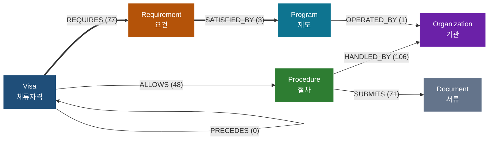

# 스키마 구조도

`config.json` 과 `output/graph.graphml` 에서 자동 생성한다 (`python make_views.py`). 괄호 안은 실제로 뽑힌 엣지 수다.

```mermaid
graph LR
  Visa["Visa<br/>체류자격"]
  Procedure["Procedure<br/>절차"]
  Requirement["Requirement<br/>요건"]
  Organization["Organization<br/>기관"]
  Program["Program<br/>제도"]
  Document["Document<br/>서류"]

  Visa ==>|"CONVERTS_TO (16)"| Visa
  Visa ==>|"REQUIRES (77)"| Requirement
  Visa -->|"ALLOWS (48)"| Procedure
  Procedure -->|"HANDLED_BY (106)"| Organization
  Procedure -->|"SUBMITS (71)"| Document
  Requirement ==>|"SATISFIED_BY (3)"| Program
  Program -->|"OPERATED_BY (1)"| Organization
  Visa -->|"PRECEDES (0)"| Visa

  style Visa fill:#1f4e79,color:#fff,stroke:none
  style Procedure fill:#2e7d32,color:#fff,stroke:none
  style Requirement fill:#b45309,color:#fff,stroke:none
  style Organization fill:#6b21a8,color:#fff,stroke:none
  style Program fill:#0e7490,color:#fff,stroke:none
  style Document fill:#64748b,color:#fff,stroke:none
```
